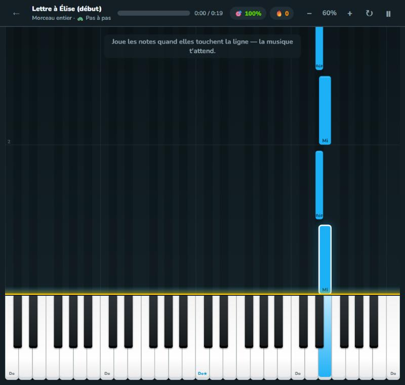
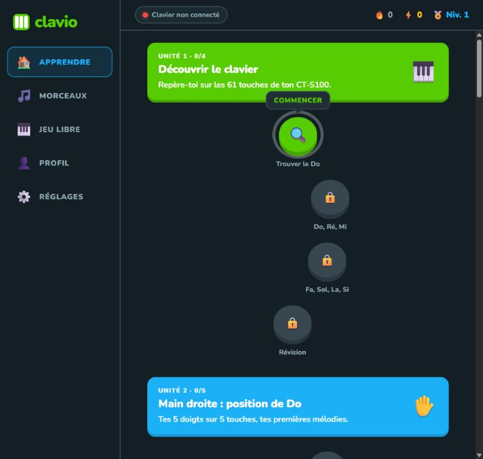
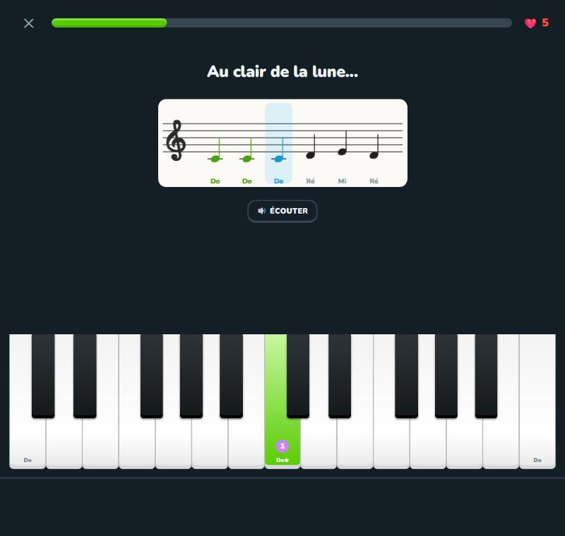
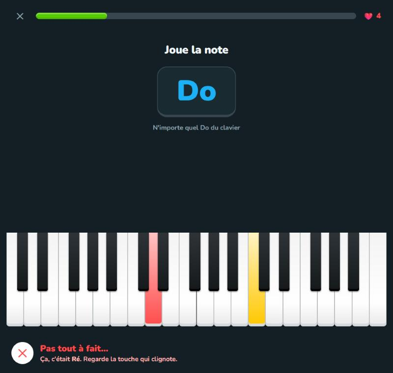
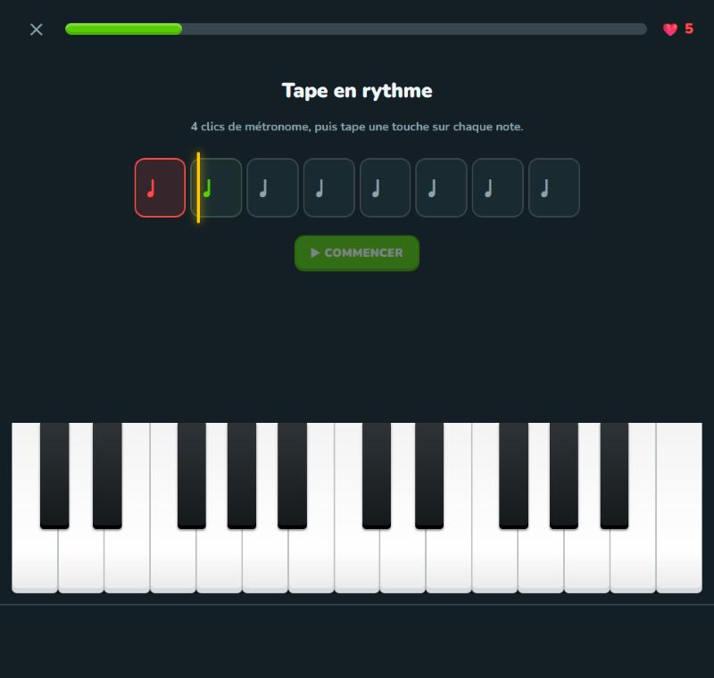
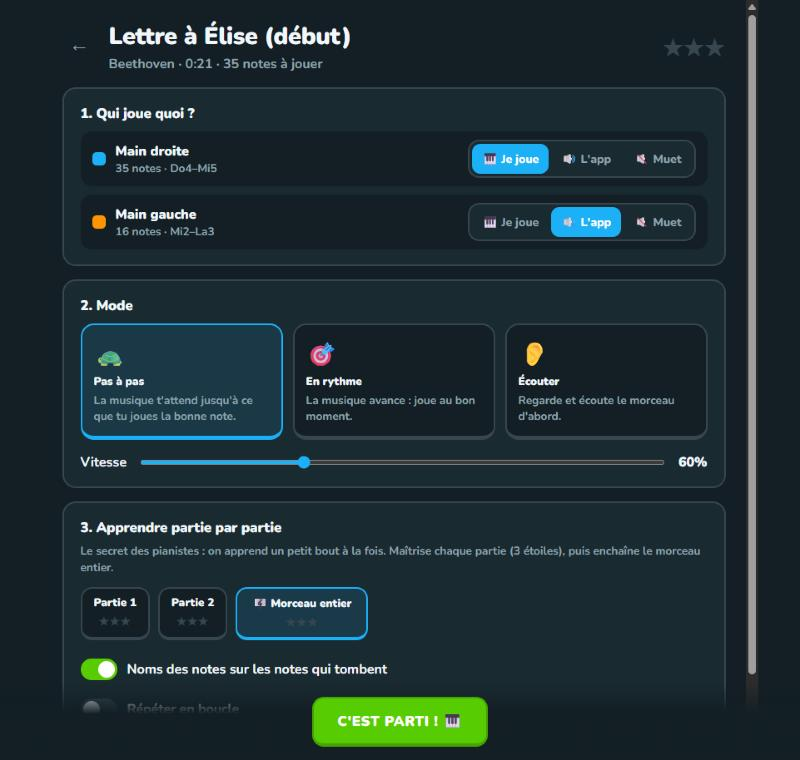

<div align="center">

# 🎹 Clavio

### Apprends le piano pas à pas, façon Duolingo

Une application web pour débuter le piano avec un **Casio CT-S100**, ou n'importe quel clavier MIDI.<br>
Des leçons courtes et des séries de jours, et surtout : **importe n'importe quel fichier MIDI**, l'app te l'apprend note par note.




</div>

---

## ✨ Fonctionnalités

<table>
<tr>
<td width="50%" valign="top">

### 🗺️ Un vrai parcours d'apprentissage
- **8 unités et 28 leçons**, de « trouver le Do » jusqu'aux deux mains
- Des exercices variés : trouver une note, lire la portée, nommer une note, répéter à l'oreille, jouer une mélodie, un accord, un rythme
- Une mascotte, **Clavi**, explique chaque notion
- Un **morceau bonus** se débloque à la fin de chaque unité

</td>
<td width="50%" valign="top">

### 🔥 La motivation façon Duolingo
- **5 cœurs** par leçon : les exercices ratés reviennent à la fin
- Des **XP**, des niveaux et un **objectif quotidien**
- Une **série de jours** consécutifs 🔥
- **16 badges** à débloquer
- Des statistiques et un graphique de la semaine

</td>
</tr>
<tr>
<td width="50%" valign="top">

### 📂 Importe n'importe quel MIDI
- Glisse-dépose tes fichiers `.mid`
- Pour chaque piste : **« Je joue »**, **« L'app joue »** ou **« Muet »**
- Séparation automatique **main droite / main gauche**
- Découpage en **parties de 4 mesures**, notées sur 3 étoiles
- Les notes hors des 61 touches sont ramenées dans la tessiture

</td>
<td width="50%" valign="top">

### 🎼 Trois modes de jeu
- 🐢 **Pas à pas** : la musique attend que tu joues la bonne note
- 🎯 **En rythme** : la musique avance, tu es noté « Parfait » ou « Bien »
- 👂 **Écouter** : une démonstration pour découvrir le morceau
- La vitesse se règle de **20 % à 150 %**, avec répétition en boucle

</td>
</tr>
</table>

Il y a aussi un mode **Jeu libre** : les 61 touches, une reconnaissance des accords en direct (« Do majeur », « La mineur »…), un métronome et un enregistreur.

## 📸 Aperçu

<table>
<tr>
<td align="center"><br><b>Le parcours</b></td>
<td align="center"><br><b>Lire et jouer sur la portée</b></td>
</tr>
<tr>
<td align="center"><br><b>Correction immédiate</b></td>
<td align="center"><br><b>Exercice de rythme</b></td>
</tr>
<tr>
<td align="center" colspan="2"><br><b>Choisir qui joue quoi, le mode et la partie à travailler</b></td>
</tr>
</table>

## 🚀 Démarrage

Aucune installation, aucune dépendance : c'est du HTML, du CSS et du JavaScript pur.

```bash
git clone https://github.com/osayanis/clavio.git
```

Ensuite, au choix :

- **Windows** : double-clique sur **`Lancer Clavio.bat`**. Un petit serveur local démarre et l'app s'ouvre dans ton navigateur.
- **N'importe quel système** : ouvre `index.html` dans **Chrome** ou **Edge**, ou sers le dossier avec le serveur statique de ton choix.

> [!IMPORTANT]
> Utilise **Google Chrome** ou **Microsoft Edge** : Firefox et Safari ne prennent pas en charge l'API Web MIDI.

## 🎹 Brancher son clavier

1. Relie le **port USB à l'arrière du CT-S100** à ton ordinateur avec un câble USB.
2. Allume le piano et ouvre Clavio.
3. Accepte l'autorisation **MIDI** quand le navigateur la demande.
4. La pastille en haut passe au **vert** : c'est prêt.

Par défaut, l'app coupe son propre son pour tes notes, puisque le piano joue déjà le sien. Tu peux changer ce réglage dans **Réglages → Son**.

**Pas de clavier sous la main ?** Tu peux jouer à la souris, au doigt sur un écran tactile, ou avec le clavier de l'ordinateur :

| Touches (AZERTY) | Rôle |
|---|---|
| `Q S D F G H J K L M` | Touches blanches, à partir du Do |
| `Z E T Y U O P` | Touches noires |
| `W` / `X` | Octave plus grave / plus aiguë |

## 📚 Le programme

| # | Unité | Ce que tu apprends | 🎁 Morceau bonus |
|:-:|---|---|---|
| 1 | **Découvrir le clavier** | Touches noires, Do central, les 7 notes | — |
| 2 | **Main droite : position de Do** | Numéros des doigts, premières mélodies, rythme | Au clair de la lune |
| 3 | **Lire la clé de Sol** | La portée, de Do à Mi aigu | Ah ! vous dirai-je, maman |
| 4 | **Main gauche & clé de Fa** | Position de Do à gauche, lecture en clé de Fa | Frère Jacques |
| 5 | **Entraîne ton oreille** | Grave ou aigu, répéter des notes et des mélodies | Vive le vent |
| 6 | **Les touches noires** | Les dièses, la gamme chromatique | Lettre à Élise |
| 7 | **Les accords** | Majeur, mineur, accompagnement à gauche | Canon de Pachelbel |
| 8 | **Les deux mains** | Coordination, mélodie et basse | Ode à la joie (2 mains) |

La bibliothèque contient **9 morceaux du domaine public**. Tous les autres arrivent par import MIDI.

## ⌨️ Raccourcis

| Où | Touche | Action |
|---|---|---|
| Morceau | `Espace` | Pause / reprise |
| Morceau | `R` | Recommencer |
| Morceau | `↑` / `↓` | Plus vite / plus lent |
| Morceau | `Échap` | Retour aux réglages |
| Leçon | `Entrée` | Continuer |
| Leçon | `1` à `4` | Choisir une réponse |
| Leçon | `Espace` | Réécouter (exercices d'oreille) |

## 🛠️ Sous le capot

```
clavio/
├── index.html          Structure de la page
├── css/style.css       Thème sombre inspiré de Duolingo
├── js/
│   ├── music.js        Noms des notes, fréquences, disposition du clavier, reconnaissance d'accords
│   ├── audio.js        Synthé de piano (Web Audio) et effets sonores
│   ├── input.js        Web MIDI, clavier d'ordinateur, souris et tactile
│   ├── piano.js        Clavier à l'écran
│   ├── staff.js        Portée musicale en SVG (clé de Sol, clé de Fa, grand système)
│   ├── midifile.js     Lecteur de fichiers MIDI standard (carte des tempos, mesures, pistes)
│   ├── songs.js        Morceaux intégrés, dans une notation texte compacte
│   ├── course.js       Le programme : unités, leçons, générateurs d'exercices
│   ├── store.js        Sauvegarde (localStorage + IndexedDB) et gamification
│   ├── lesson.js       Moteur de leçon (cœurs, retours, révisions)
│   ├── practice.js     Notes qui tombent, modes pas à pas / rythme / écoute
│   └── app.js          Navigation et écrans
├── serveur.ps1         Mini serveur web local (PowerShell)
└── Lancer Clavio.bat   Lanceur en double-clic
```

- **Aucune bibliothèque externe** : le lecteur MIDI, le synthé et la portée sont écrits à la main.
- **Le son est synthétisé** en temps réel avec la Web Audio API (harmoniques, filtre, réverbération), sans aucun échantillon à télécharger.
- **Tes données restent chez toi** : la progression est stockée dans `localStorage` et les fichiers MIDI dans `IndexedDB`, dans ton navigateur. Rien n'est envoyé sur Internet.

## 🗺️ Idées pour la suite

- [ ] Doigtés suggérés automatiquement pour les fichiers MIDI importés
- [ ] Nouvelles unités : gammes, arpèges, nuances
- [ ] Affichage de la partition complète des morceaux
- [ ] Version en ligne sur GitHub Pages
- [ ] Export et import de la progression

---

<div align="center">

Fait avec ❤️ pour apprendre le piano, une note à la fois.

</div>
